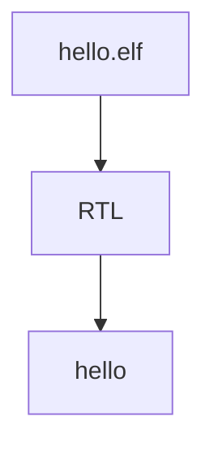

# RISC-V Verification
 
## Overview

RISC-V is freedom, flexible, royalty free, ISA for designing hardware. But more flexible means more verification complexity.
Multiple features, every feature addition adds to verfication complexity.

No current DV for processors. Till now processors were made only by big vendors who do all their verification in house.
Users just have to take the processor and verify the subsystems.

## Steps

0. Finding the team
1. What ot verify, metrics
2. Software development by side
3. Co-processor, sub system integration
4. Custom opcodes, extensions, features
5. Verification plan
6. Tools, models and methods
7. Combined formal and functional verification
8. Develop test bench, test vecors.
9. Verify triage, fix
10. Coverage and RTL signoff
11. Benchmark and integration testing

## Hardware DV Approaches

### 0. "Hello world"

If you can run program on it, DV is done. Eg running embedded level scripts, rtos, linux etc.
This if fine for small projects but not for large scale projects

#Question  How to run .elf file on RTL ?

### 1. Simple check

# References